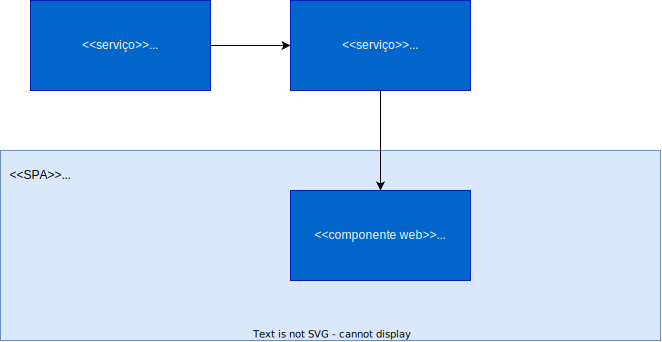
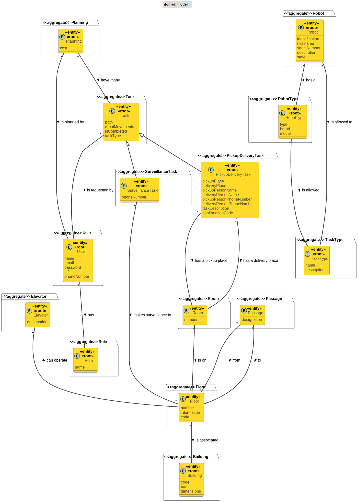

## Contents
- [System Overview](#System_Overview)
- [Modules](#Modules)
- [Views](#views)
	- [Introduction](#introduction)
	- [Nível 1](#nível_1)
	- [Nível 2](#nível_2)
	- [Nível 3 (GestaoInfo)](#nível_3_planeamento)

## Modules
#### MGI
O módulo de gestão de informação é responsável por gerir toda a informação relacionada com o campus e com a frota de robôs.

#### MP
O módulo de planeamento é responsavel por processar os caminhos que os robos terão de fazer entre os diferentes pontos de acesso do campus, como salas/gabinetes, elevadores e passagens entre edifícios. 

#### MPT
O módulo de planeamento de tarefas é responsável pela gestão das tarefas.

#### SPA
A single page application é a UI da nossa aplicação, onde os diferentes tipos de utilizadores do sistema, podem interagir com os diferentes tipos de serviços da aplicação.

## System Overview

## Diagrama de Domínio

# Views

## Introduction
Será adotada a combinação de dois modelos de representação arquitetural: C4 e 4+1.

O Modelo de Vistas 4+1 [[Krutchen_1995]](References.md#Kruchten_1995) propõe a descrição do sistema através de vistas complementares permitindo assim analisar separadamente os requisitos dos vários stakeholders do software, tais como utilizadores, administradores de sistemas, project managers, arquitetos e programadores. As vistas são deste modo definidas da seguinte forma:

_ Vista lógica: relativa aos aspetos do software visando responder aos desafios do negócio;
_ Vista de processos: relativa ao fluxo de processos ou interações no sistema;
_ Vista de desenvolvimento: relativa à organização do software no seu ambiente de desenvolvimento;
_ Vista física: relativa ao mapeamento dos vários componentes do software em hardware, i.e. onde é executado o software;
_ Vista de cenários: relativa à associação de processos de negócio com atores capazes de os espoletar.

O Modelo C4 [[Brown_2020]](References.md#Brown_2020)[[C4_2020]](References.md#C4_2020) defende a descrição do software através de quatro níveis de abstração: sistema, contentor, componente e código. Cada nível adota uma granularidade mais fina que o nível que o antecede, dando assim acesso a mais detalhe de uma parte mais pequena do sistema. Estes níveis podem ser equiparáveis a mapas, e.g. a vista de sistema corresponde ao globo, a vista de contentor corresponde ao mapa de cada continente, a vista de componentes ao mapa de cada país e a vista de código ao mapa de estradas e bairros de cada cidade.
Diferentes níveis permitem contar histórias diferentes a audiências distintas.

Os níveis encontram_se definidos da seguinte forma:
_ Nível 1: Descrição (enquadramento) do sistema como um todo;
_ Nível 2: Descrição de contentores do sistema;
_ Nível 3: Descrição de componentes dos contentores;
_ Nível 4: Descrição do código ou partes mais pequenas dos componentes (e como tal, não será abordado neste DAS/SAD).

Pode_se dizer que estes dois modelos se expandem ao longo de eixos distintos, sendo que o Modelo C4 apresenta o sistema com diferentes níveis de detalhe e o Modelo de Vista 4+1 apresenta o sistema de diferentes perspetivas. Ao combinar os dois modelos torna_se possível representar o sistema de diversas perspetivas, cada uma com vários níveis de detalhe.

Para modelar/representar visualmente, tanto o que foi implementado como as ideias e alternativas consideradas, recorre_se à Unified Modeling Language (UML) [[UML_2020]](References.md#UML_2020) [[UMLDiagrams_2020]](References.md#UMLDiagrams_2020).

## Nível 1
[Nível 1](README_LV1.md)

## Nível 2
[Nível 2](README_LV2.md)

## Nível 3
[Nível 3](README_LV3.md)

