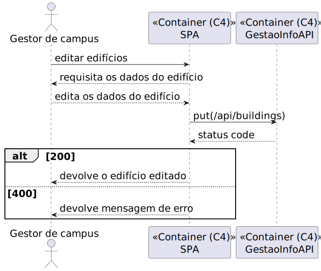
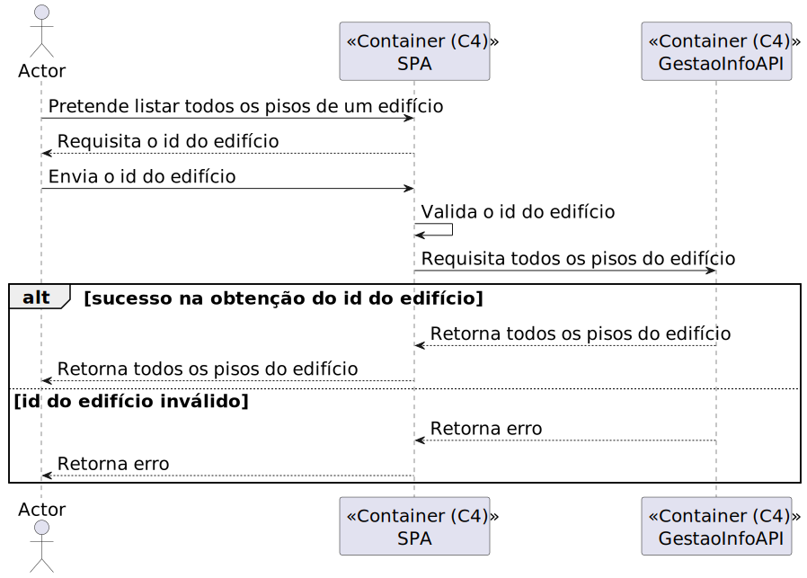

## Contents
- [Vista Lógica](#vista_lógica_1)
- [Vista de Processos](#vista_de_processos_1)
	- [SSD US150](#ssd_us150)
	- [SSD US160](#ssd_us160)
	- [SSD US170](#ssd_us170)
	- [SSD US180](#ssd_us180)
	- [SSD US190](#ssd_us190)
 	- [SSD US200](#ssd_us200)
	- [SSD US210](#ssd_us210)
	- [SSD US220](#ssd_us220)
	- [SSD US230](#ssd_us230)   
	- [SSD US240](#ssd_us240)
	- [SSD US250](#ssd_us250)
	- [SSD US260](#ssd_us260)
	- [SSD US270](#ssd_us270)
 	- [SSD US310](#ssd_us310)
	- [SSD US350](#ssd_us350)
	- [SSD US360](#ssd_us360)
	- [SSD US370](#ssd_us370) 
- [Vista de Implementação](#vista_de_implementação)
- [Vista Física](#vista_física)

# Views

## Vista Lógica

## Vista de Processos

### SSD US150

### SSD US160

### SSD US170

### SSD US180

### SSD US190

### SSD US200

### SSD US210

### SSD US220

### SSD US230

### SSD US240

### SSD US250

### SSD US260

### SSD US270

### SSD US310

### SSD US350

### SSD US360

### SSD US370

## Vista de Implementação

## Vista Física

