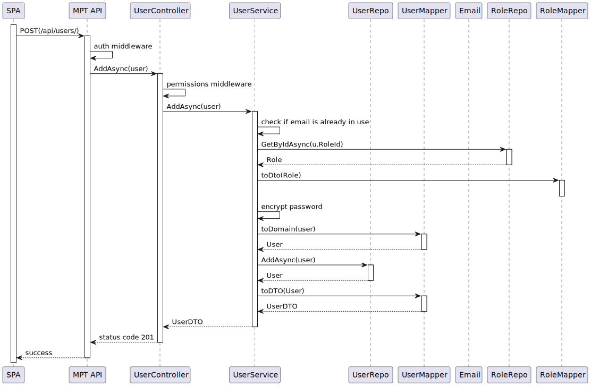
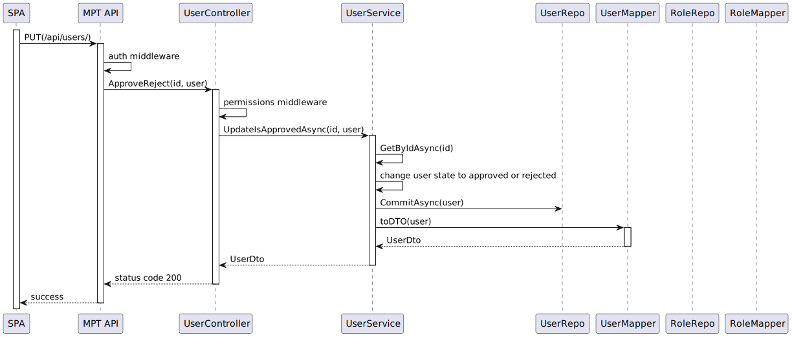
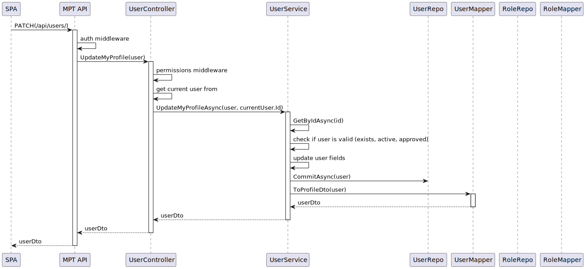
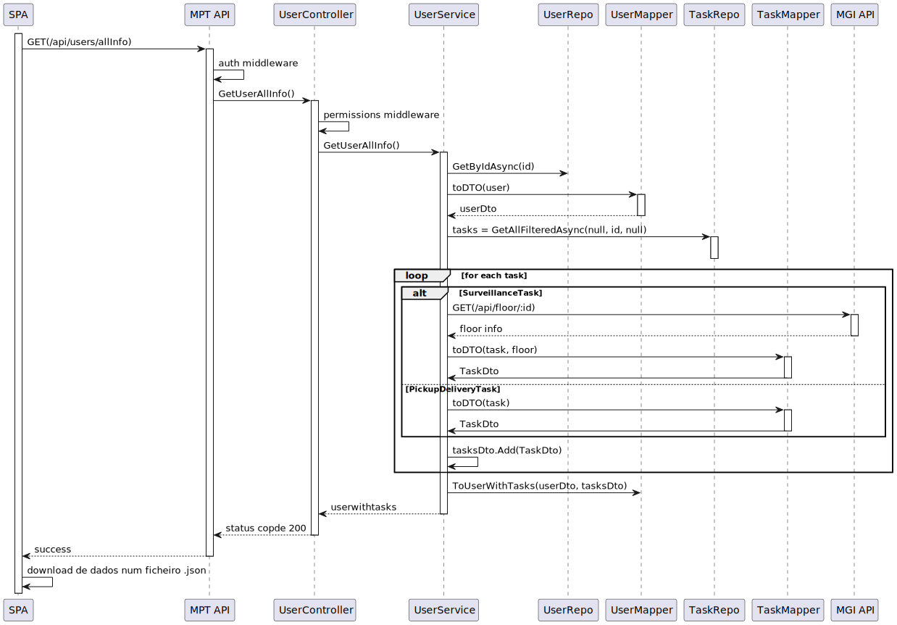
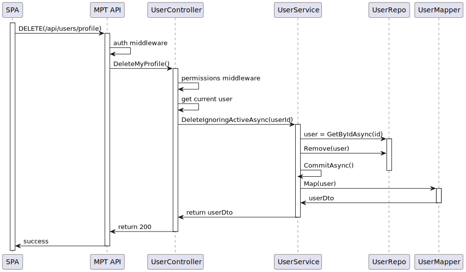
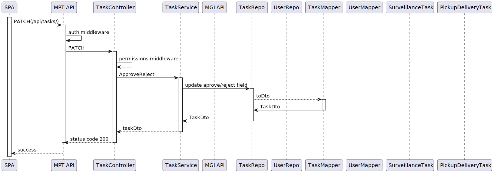
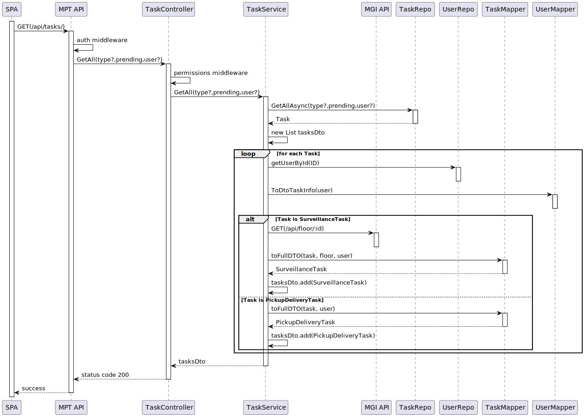

## Contents
- [Vista Lógica](#vista_lógica_5)
- [Vista de Processos](#vista_de_processos_5)
	- [SSD US10](#ssd_us10)
	- [SSD US20-70](#ssd_us20-70)
	- [SSD US80](#ssd_us80)
	- [SSD US100](#ssd_us100)
	- [SSD US110](#ssd_us110)
	- [SSD US120](#ssd_us120)
    - [SSD US460](#ssd_us460) 
	- [SSD US470](#ssd_us470) 
	- [SSD US480](#ssd_us480) 
	- [SSD US500](#ssd_us500)  

- [Vista de Implementação](#vista_de_implementação_4)
- [Vista Física](#vista_física_4)

# Views

## Vista Lógica

## Vista de Processos
### SSD US10

### SSD US20-70

### SSD US80

### SSD US100

### SSD US110

### SSD US120

### SSD US460

### SSD US470

### SSD US480

### SSD US500

## Vista de Implementação

## Vista Física

